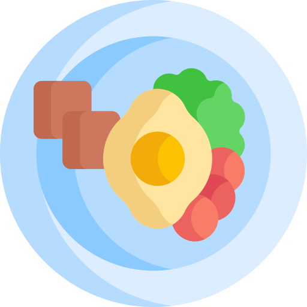

  <h1 align="center">All My Food  
  
  </h1>
  
(clic en la imagen para ir a descarga)

  

    <a href="https://github.com/UCASV/entrega-de-proyecto-pdm-0120-editorial/releases/tag/v0.1.0">
      
    <a/>
    
    
    
    
  

  
## Summary
[Tablero](#tablero-de-equipo) 
[App](#app) 
&nbsp;&nbsp;&nbsp;&nbsp;[Usuario de prueba](#app) 
&nbsp;&nbsp;&nbsp;&nbsp;[Funcionalidades](#funcionalidades) 
&nbsp;&nbsp;&nbsp;&nbsp;[Google Sign In](#google-sign-in) 
[API](#api) 
&nbsp;&nbsp;&nbsp;&nbsp;[Modelos](#modelos) 
&nbsp;&nbsp;&nbsp;&nbsp;[Rutas](#rutas) 
&nbsp;&nbsp;&nbsp;&nbsp;[ImageParser](#imageparser) 

## Tablero de equipo
[Notion.so](https://www.notion.so/Food-App-65fa094f2eb24290aebd059e03d679fa)

## APP

### Usuario de prueba

| Clave     | Tipo              |
|-----------|-------------------|
| usuario   | dei.uca           |
| password  | admin             |

### Funcionalidades

* Crear receta, ya sea pública o privada
* Crear una lista, siempre son privadas
* Actualizar una lista
* Registrarse
* Logearse
* Logearse con Google
* Ver todas las recetas que tienen configuración pública (explorar)
* Ver todas las recetas que tienen configuración privada (mis recetas)

### Google Sign In
La aplicación cuenta on OAUTH 2.0 de Google para que los usuarios puedan iniciar sesión de una manera más eficiente y sencilla, almacenando sus datos (no sensibles) en la API y así llevar un registro de sus elementos y preferencias.

## API
La apliación está alimentada por la API foodAPI. En un overview, se conecta a una BD en MongoAtlas, y su deploy se encuentra en heroku.

## Modelos

### User

| Clave     | Tipo              |
|-----------|-------------------|
| username  | String            |
| fullname  | String            |
| password  | String            |
| email     | String            |
| userImage | File              |
| lists     | Array[ListSchema] |

### List

| Clave    | Tipo                 |
|----------|----------------------|
| name     | String               |
| listType | String               |
| elements | Array[ElementSchema] |

### Element

| Clave    | Tipo   |
|----------|--------|
| desc     | String |
| quantity | String |

### Recipe

| Clave       | Tipo          |
|-------------|---------------|
| author      | String        |
| title       | String        |
| desc        | String        |
| recipeType  | String        |
| steps       | Array[String] |
| ingredients | Array[String] |
| privacy     | Boolean       |
| recipeImage | String        |

## Rutas
**Main** https://food-api-wrmh.herokuapp.com/

| Method | Path                                                                   | Action                                                                 |
|--------|------------------------------------------------------------------------|------------------------------------------------------------------------|
| GET    | /                                                                      | Devuelve todos los usuarios registrados                                |
| GET    | /user?username&password                                                | Login                                                                  |
| POST   | /user/:username/:fullname/:password/:email/:userImage                  | Registra al usuario                                                    |
| GET    | /list?username                                                         | Obtiene todas las listas almacenadas de un usuario                     |
| POST   | /list/:username/:name/:desc/:elements                                  | Crea una lista para el usuario indicado                                |
| PUT    | /list/:_id/:username/:name/:desc/:elements                             | Actualiza la lista por su _id                                          |
| GET    | /recipe                                                                | Obtiene todas las recetas con privacidad pública                       |
| GET    | /recipe?author                                                        | Obtiene todas las recetas de un usuario                                |
| POST   | /recipe/:author/:title/:desc/:ingredients/:steps/:privacy/:recipeImage | Crea una receta, la privacidad depende de la configuración del usuario |

## ImageParser
Los archivos de tipo imagen son recibidos en la API y trabajados con **multer, multerS3, y AWS** (npm). Cada archivo es filtrado por multer, tomando en cuenta los <pre>image/*</pre> provistos por JavaScript.
MulterS3 se conecta a un bucket S3 de AWS para subir la image, para asegurar unicidad en nombres se toma el ISOString de la fecha en la que es recibido más el nombre original del
archivo. Se limitan a un tamaño de 1024 * 1024 * 5.

Icons made by <a href="https://www.flaticon.com/authors/freepik" title="Freepik">Freepik</a> from <a href="https://www.flaticon.com/" title="Flaticon"> www.flaticon.com</a>
